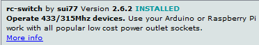

# 433MHz Arduino RFSend

This is an example for the control of simple 433MHz radio sockets as you can buy them e.g. in a DIY store. It only works with models that use 10 little Dip switches to set the codes.

## Requirements
### Hardware
- Arduino Nano
- 433MHz RF send module


### Software
- [Python 3](https://www.python.org/downloads/)
- [Arduino IDE](https://www.arduino.cc/en/Main/Software)

## Installation
### Arduino sending station
#### Hardware
Connect the VCC wire of the sender to 5V, GND to GND and Data to Pin 10 (or any free Pin).

#### Software
1. Install the [rc-switch](https://github.com/sui77/rc-switch) library using the arduino library manager

2. Edit the Pin Number according to your used Pin
2. Upload the sketch [433MHz-Arduino-Sender.ino](433MHz-Arduino-Sender/433MHz-Arduino-Sender.ino) to the Nano using the Arduino IDE

You can test your Arduino using the serial monnitor, just type
```Test``` and it should respond with ```I am up and running!```.

### Python serial send script

You _can_ use this Python script to send the wireless power socket codes to the Arduino.
1. Install pyserial using ```pip3 install pyserial```
2. Open the [rfsend.py](rfsend.py) file in notepad or any other editor and edit the serial port in line 17.

On Linux, you can get the serial port using ```ls /dev/ttyUSB*```,
on Windows, you can just look in the Arduino IDE Port setting on in the Device Manager.

### Getting the systemcode and unitcode of your power outlets
This code only supports power outlets with 10 little switches for setting the codes.
Just open the little door on the back of the outlet and look at the switches.
The first five (usually 1-5) are the systemcode and the last 5 (A-E) are the unitcode.
Up = 1 and Down = 0

## Usage
Run rfsend.py in a terminal using ```python3 rfsend.py systemcode unitcode```, 
for example ```python3 /path/to/rfsend.py ON 11010 01000```

or on Windows: ```py C:\Users\Path\to\rfsend.py ON 11010 01000```

### Example for Home Assistant
```
switch:
  - platform: command_line
    switches:
      my_switch:
        command_on: python3 /path/to/rfsend.py ON 11010 01000
        command_off: python3 /path/to/rfsend.py OFF 11010 01000
```


Happy switching!